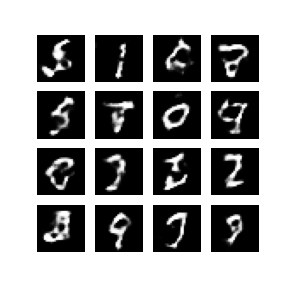

## Image Generation using DCGAN
Tensorflow implementation of Number Generation using DCGAN from the paper [Deep Convolutional Generative Adversial Network](https://arxiv.org/pdf/1511.06434.pdf)
### Result
This is the result of training for 30 epochs, more epochs will tend to provide better results.

### Training Process
The following gif demonstrates the generation through the training process. 

### Resources
* [NIPS GAN tutorial](https://arxiv.org/pdf/1701.00160.pdf)
* [MIT Deep Learning](http://introtodeeplearning.com/)
